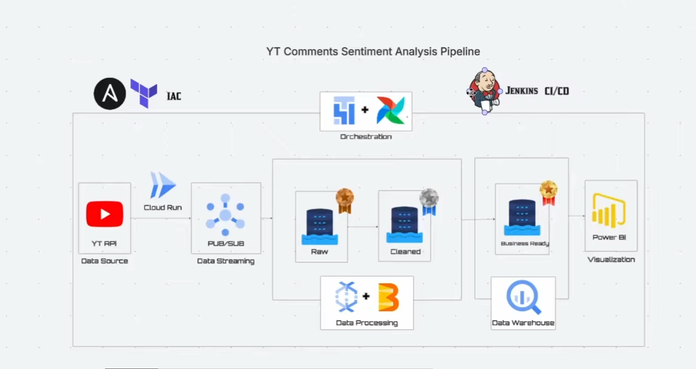
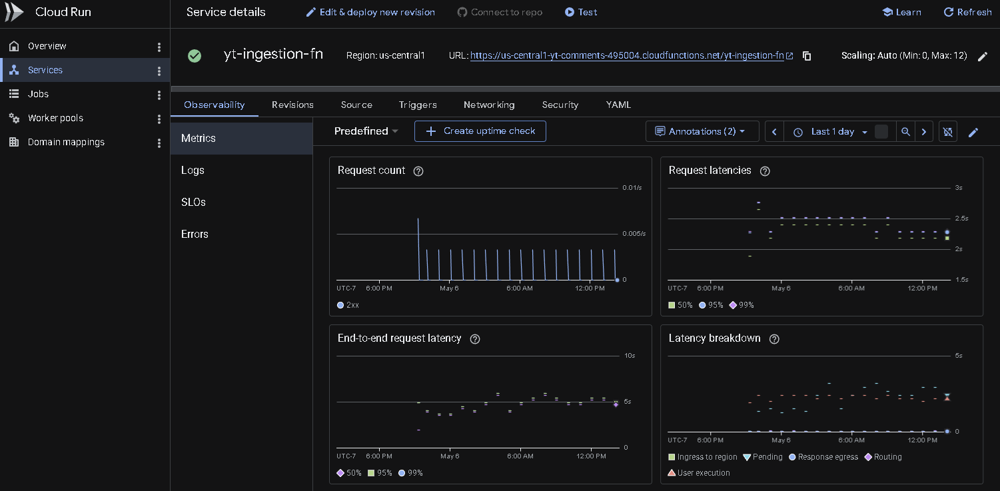
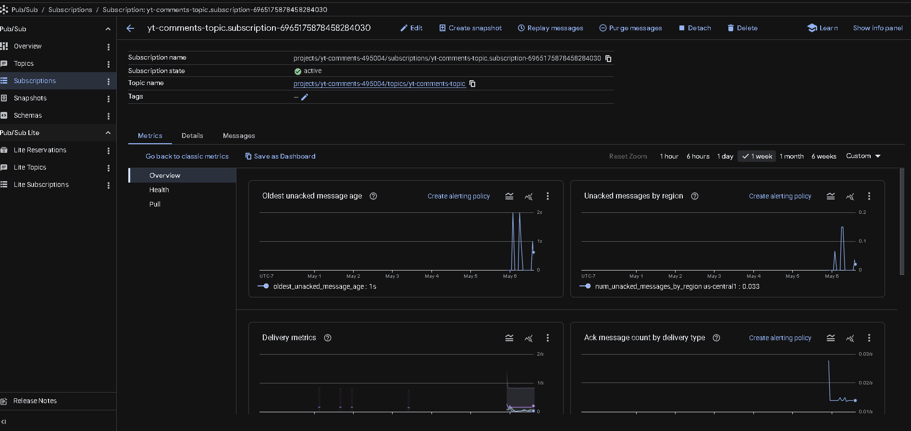
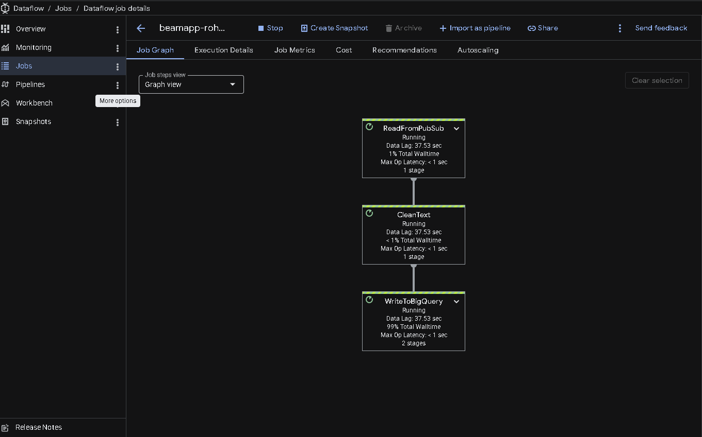
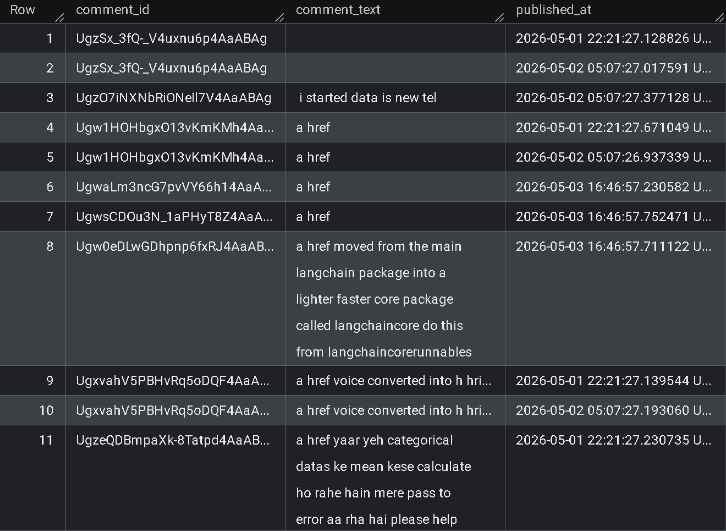
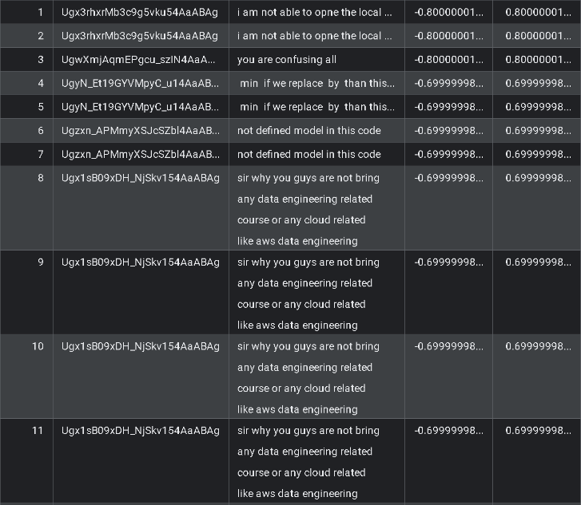
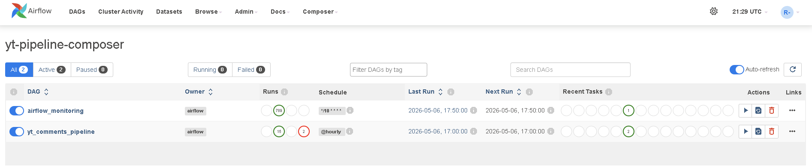
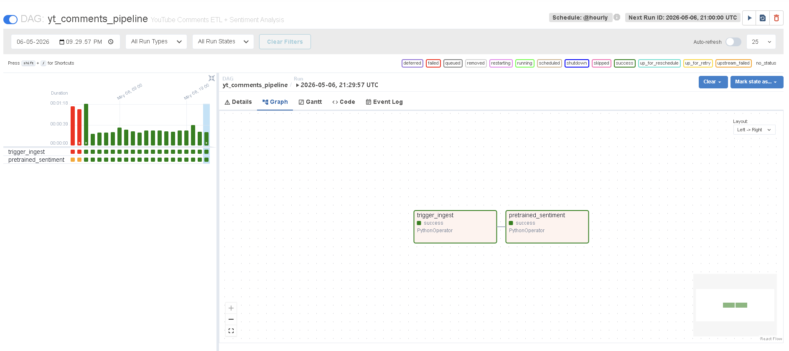
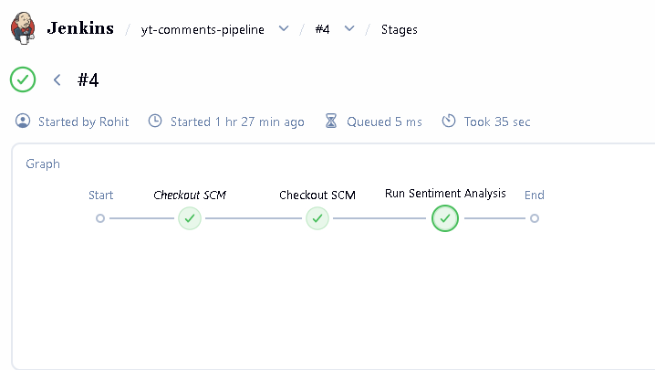

# YouTube Comments Sentiment Analysis Pipeline (GCP)

End-to-end data engineering project that ingests YouTube comments, streams them through Google Cloud Pub/Sub, processes/cleans them with Apache Beam on Dataflow, stores curated datasets in BigQuery, and runs sentiment analysis using the Google Cloud Natural Language API. Orchestration is handled by Cloud Composer (Airflow), infrastructure is provisioned with Terraform, and repeatable deployments are automated with Ansible (with Jenkins CI/CD driving operational workflows).

> Note: The architecture diagram originally referenced Power BI; this implementation uses **Looker Studio** for the final visualization dashboard.

## Architecture



### High-level flow

1. **Ingestion (HTTP)**: A Google Cloud Function (Cloud Functions 2nd gen / Cloud Run runtime) fetches the latest comments from the **YouTube Data API** and publishes each comment as a message to **Pub/Sub**.
2. **Streaming processing**: An **Apache Beam** pipeline runs on **Dataflow (streaming)**, reads from the Pub/Sub topic, cleans/normalizes the text, and appends results into **BigQuery**.
3. **Warehouse / serving**: BigQuery holds a curated dataset for analytics.
4. **Sentiment enrichment**: A batch step calls the **Cloud Natural Language API** to score comment sentiment and writes the enriched results back to BigQuery.
5. **Orchestration**: **Cloud Composer (Airflow)** schedules and coordinates ingestion + sentiment steps.
6. **Visualization**: **Looker Studio** connects to BigQuery to power an analytics dashboard.

## Dashboard

Looker Studio connects directly to BigQuery tables produced by the pipeline.

## Screenshots

### Ingestion (Cloud Functions 2nd gen / Cloud Run runtime)



### Streaming (Pub/Sub)



### Processing (Dataflow)



### Warehouse (BigQuery)




### Orchestration (Cloud Composer / Airflow)




### CI/CD (Jenkins)



## Skills demonstrated (recruiter-friendly)

- **Streaming architecture**: Pub/Sub → Dataflow (streaming) → BigQuery
- **ETL/ELT patterns**: raw events → cleaned tables → analytics-ready sentiment outputs
- **Cloud orchestration**: Airflow DAGs in Cloud Composer, scheduled hourly
- **GCP data stack**: BigQuery, Dataflow, Pub/Sub, Cloud Functions, Cloud Storage
- **ML/NLP enrichment**: Cloud Natural Language sentiment scoring
- **Infrastructure as Code**: Terraform modules for IAM, Composer, Pub/Sub, BigQuery, and Storage
- **Automation & CI/CD**: Jenkins + Ansible playbooks for repeatable deployments and runs

## Tech stack

- **Language**: Python
- **Ingestion**: Google Cloud Functions (HTTP-triggered)
- **Messaging**: Google Cloud Pub/Sub
- **Processing**: Apache Beam on Google Cloud Dataflow (streaming)
- **Storage/Warehouse**: BigQuery
- **Orchestration**: Cloud Composer (Apache Airflow)
- **IaC**: Terraform
- **Deployment automation**: Ansible
- **CI/CD**: Jenkins
- **BI**: Looker Studio

## Data model (BigQuery)

This project creates a `youtube_comments` dataset and two primary tables:

- `youtube_comments.comments`
	- `comment_id` (STRING)
	- `comment_text` (STRING)
	- `published_at` (TIMESTAMP)

- `youtube_comments.sentiment`
	- `comment_id` (STRING)
	- `comment_text` (STRING)
	- `sentiment_score` (FLOAT)
	- `sentiment_magnitude` (FLOAT)

Conceptually, the layers map to the diagram as:

- **Raw**: Pub/Sub message stream (event layer)
- **Cleaned**: BigQuery `comments` (normalized text)
- **Business-ready**: BigQuery `sentiment` (analytics-ready enrichment)

## Orchestration (Airflow / Cloud Composer)

The Airflow DAG is scheduled **hourly** and performs:

1. **Trigger ingestion** via an HTTPS call to the Cloud Function endpoint.
2. **Run sentiment analysis** and write scores into BigQuery.

## Repository structure

```
app/                 # Cloud Function source (YouTube API -> Pub/Sub)
dataflow/            # Apache Beam streaming pipeline (Pub/Sub -> BigQuery)
dags/                # Airflow DAG for orchestration (Cloud Composer)
infra/               # Terraform (GCP IAM, Pub/Sub, BigQuery, Composer, GCS)
ansible/             # Playbooks for deploy/run automation
ml/                  # Sentiment analysis job (Cloud Natural Language -> BigQuery)
Jenkinsfile          # CI/CD pipeline (example automation entrypoint)
```

## Configuration

### YouTube ingestion config

The ingestion function expects a local YAML config file at `app/config.yaml` (not committed by default) with values like:

```yaml
youtube_api_key: "YOUR_YT_API_KEY"
channel_id: "TARGET_CHANNEL_ID"
max_results: 100
pubsub_topic: "yt-comments-topic"
```

The deploy playbook packages the `app/` directory, so ensure `app/config.yaml` exists before deploying.

### Dataflow config

The streaming pipeline reads `dataflow/config.yaml` for project, bucket, Pub/Sub topic, and BigQuery dataset/table configuration.

## Provisioning & deployment (GCP)

Prereqs:

- `gcloud` authenticated and set to your target project
- Terraform `>= 1.5`
- Python 3.10+
- Ansible

### 1) Provision infrastructure (Terraform)

From the `infra/envs/dev` folder:

```bash
terraform init
terraform apply
```

This provisions:

- IAM service account and project roles
- Pub/Sub topic
- BigQuery dataset + tables
- GCS buckets (Dataflow temp/staging + Cloud Function source)
- Cloud Composer environment

### 2) Deploy ingestion Cloud Function (Ansible)

```bash
ansible-playbook ansible/playbooks/deploy_cf.yml
```

### 3) Deploy streaming pipeline (Ansible)

```bash
ansible-playbook ansible/playbooks/deploy_dataflow.yml
```

### 4) Deploy the Airflow DAG (Ansible)

```bash
ansible-playbook ansible/playbooks/deploy_dag.yml
```

### 5) Run sentiment job (optional manual)

You can run the sentiment job directly (or let Airflow run it):

```bash
ansible-playbook ansible/playbooks/run_pretrained_sentiment.yml
```

## CI/CD (Jenkins)

The included Jenkins pipeline shows one way to operationalize the workflow:

- Jenkins injects a GCP service account key via credentials.
- The pipeline authenticates with `gcloud` and runs Ansible playbooks (e.g., to execute sentiment enrichment).

## Notes / assumptions

- Dataflow runs in **streaming mode** and appends to BigQuery.
- Sentiment enrichment currently processes a bounded sample (`LIMIT 100`) for simplicity; adjust the query logic for production-scale backfills.

